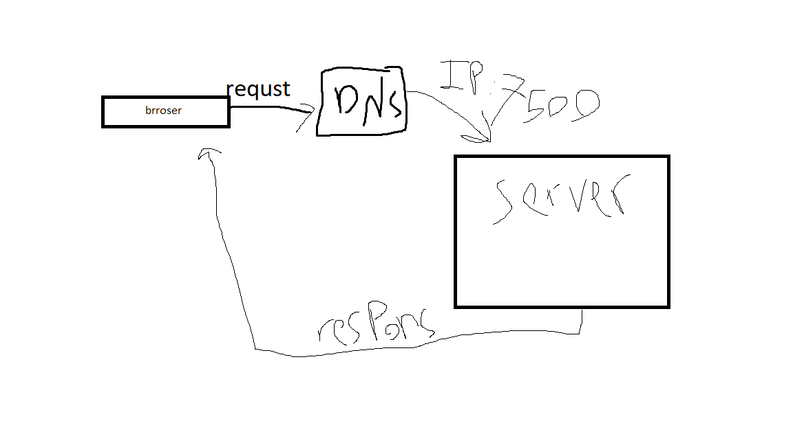

# Movies-Library v1

movie app that can check the latest movies based on categories.
acces to 3rd party API  to git data and stor it in db afeter that can delete  and update it

## following routes using the GET ,PUST ,PUT and DELETE request:

* Home Page Endpoint: /
** route with a method of get and a path of /  callback  spesific JSON data.

* /getMovies:  Rquest to the 3rd party API to get all the data from the database
* /trending : Get the trending movies data from the Movie DB API  [Link](https://api.themoviedb.org/3/trending/all/week?api_key=37ddc7081e348bf246a42f3be2b3dfd0&language=en-US)
* /search: Search for a movie name to get its information 
* /UPDATE/id:  an update request to update your comments for a specific movie in the database.
* /DELETE/id :  delete request to remove a specific movie from your database.
* /getMovie/id: a get request to get a specific movie from the database

* addMovie :  request to save a specific movie to database along with your personal comments.

## Deplyment

 [url in heroku](https://movie-wael.herokuapp.com/)
## WRRC

## Getting Started
npm  init -y
npm i express cors

## Project Features
node and js
add rout and api
reade from api and connect it eith db and (add , update ,selsect,delete) from it using put post delete and git mithode 

